# 								Assignment 1 

## 	Exploring Multi-Core, Instruction-Level, and SIMD Parallelism

#### 总结：1.如何对负载进行正确的划分，是对特定的数据集进行处理，还是使用泛化的算法？

#### 			2.在不同并行编程模型下，对于特定的问题应该采用哪种编程模型，他们对于不同问题来说的优缺点是什么？

## 一.prob1_mandelbrot_threads

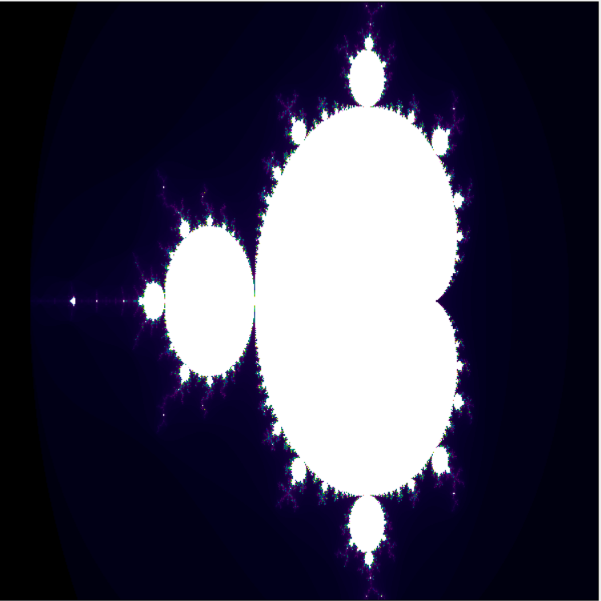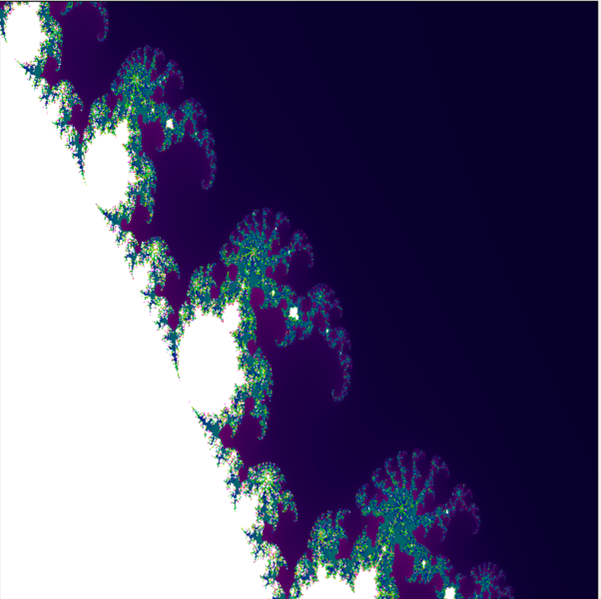

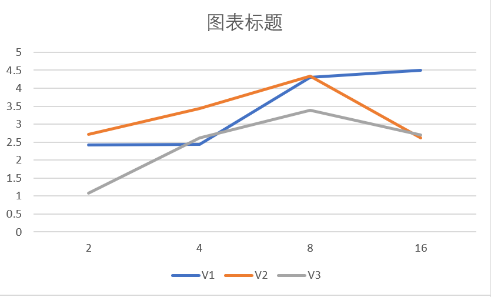

不太准波动大

## 二.prob2_vecintrin

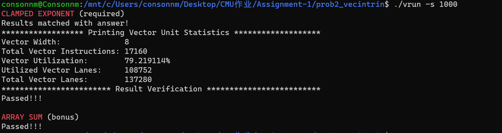

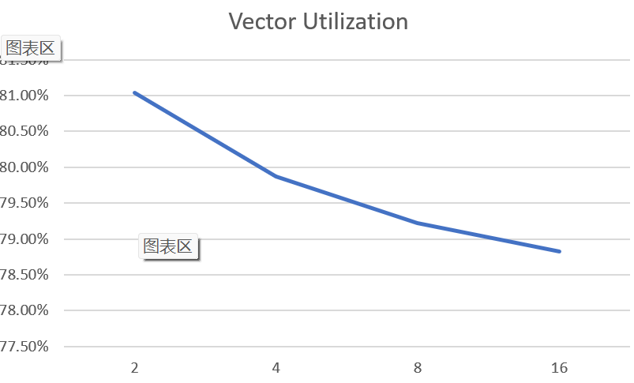

### 三.prob3_mandelbrot_ilp1

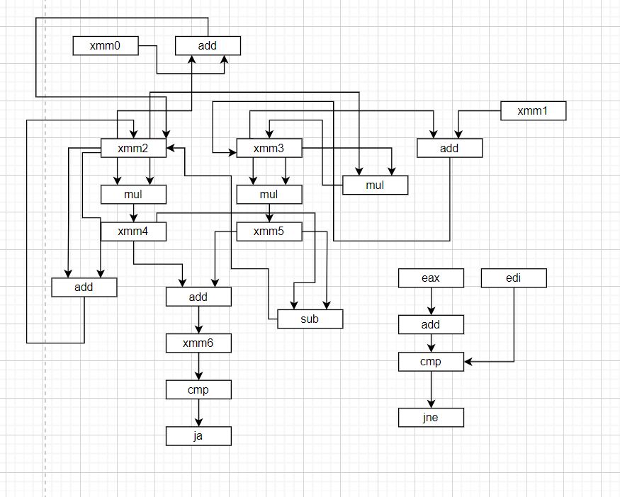

### 四.prob4_mandelbrot_ispc

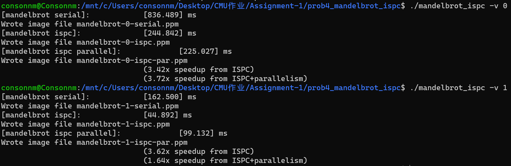

+  图一下发双向并行反而会更慢，因为图一是上下对称的，原本划分的方式导致了负载的不均衡，修改后

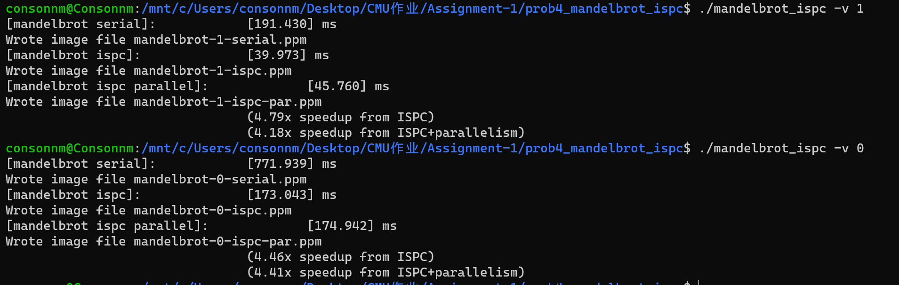

+ 修改block size

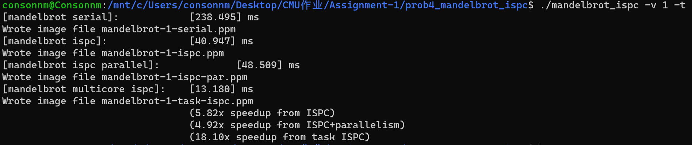

+ Pthread 抽 象 (在问题 1 中 使用 )和 ISPC 任 务 抽 象有什 么区别？

  ISPC任务通常都是数据并行，根据系统的物理资源和当前负载情况来自动分配线程，以保证最佳的性能和资源利用率，竞争和死锁问题更少，竞争和死锁问题更少

### 五.prob5_cuberoot

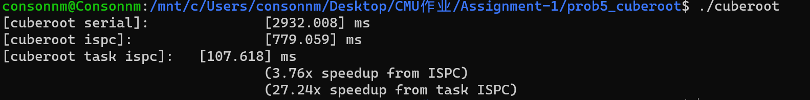

1.单核加速比3.76，多核加速比27.24

2.修改数据观察加速比（观察给出的输入和迭代次数关系图）

+ 将所有的数据设置成-1
+ 原因：计算时迭代的次数过少，无法忽略，数据初始化，内存分配等花费的时间导致加速比下降

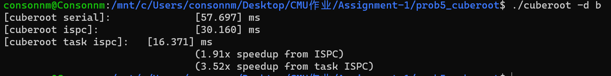

+ 数据1.9，-1，交替设置

+ 原因：负载不均衡

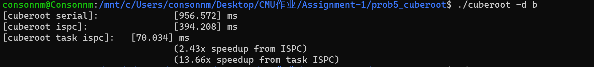

+ 所有的数据设置成1.9
+ 原因：负载均衡，迭代次数较大

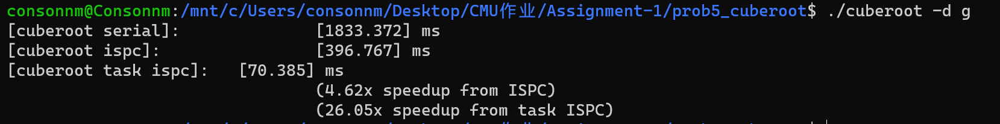

