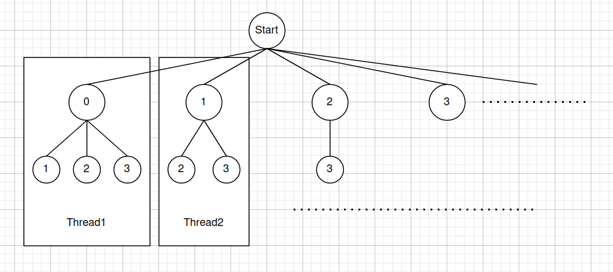
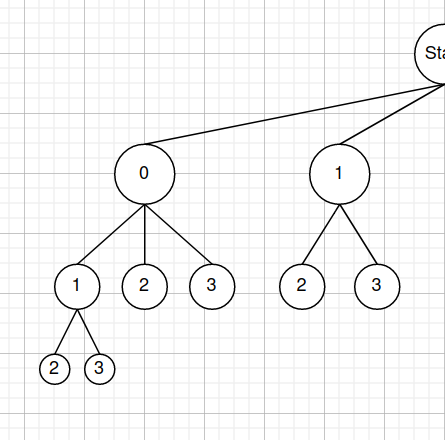

# 使用OpenMP优化

## 优化思路

### 如何并行化？

​	在分析时，已经了解了程序的大概结构：使用combine函数递归穷举支撑点的所有组合（搜索解答树），当到达叶子节点时，调用rebuild_coord重新计算所有节点的坐标，用chebyshev_sum去计算并累加切比雪夫距离之和，再将切比雪夫距离之和用插入排序添加到结果集和中。

​	因此考虑将整棵解答树的搜索改为多个对解答树子树的搜索，并记录每棵子树搜索的前m个结果，在搜索结束后插入到一个公共的结果集合中。



​	很容易发现会存在负载不均衡的问题，越左侧的子树越大。因此可以在OpenMP的线程调度上进行调整（如使用动态调度）。

### 减少重复计算

​	对于 0 - 1 - 2 与 0 - 1 - 3 两条路径，如下图所示：



​	如果按照原算法，在搜索到叶子节点时，将分别计算 以 0、1、2和0、1、3为支撑点的坐标，再用新的坐标计算切比雪夫距离之和。很容易发现其中对0、1两个支撑点的操作是重复的（计算每个点到它们的距离、计算切比雪夫距离）。

​	因此，换一个思路看待计算过程，引入一个n*n矩阵存储每两个点之间的切比雪夫距离，改为每选中一个支撑点后更新切比雪夫距离矩阵，到达叶子节点后进行累加。这样即可减少大量重复的计算（k和n越大，减少的重复计算越多）。

## 实现

### 并行化的实现

​	保留原来的combine函数，在main函数与combine函数之间添加一层combine_base函数，利用这个函数将第一层递归替代为for循环，并使用OpenMP将for循环并行化。

```c
void combine(){
    if(ki == k - 1)
        return ;
   	for(int i ...);
}

void combine_base() {
    #pragma omp parallel for
    for(int i = 0; i < n; i++) {
        // 为线程准备内存
        int pivots[];
        double max_sums[], min_sums[], max_pivots[], min_pivots[];
    	// 初始化好数据后，调用combine（从ki = 1开始）
        combine(ki = 1...);
        // combine结束后，将局部数据插入全局数据中
    }
}

int main(){
    // combine(ki = 0...);
    combine_base();
}
```

### 减少重复计算的实现

```c
void combine(int pivots[], double pre_chebyshevs[]) {
    if(ki == k - 1) {
        for(int i = pivots[ki - 1] + 1; i < n; i++) {
            // 计算添加第k个pivot后的chebyshevs矩阵，并求和
            double chebyshev = calc_chebyshev_sum();
            // 向线程维护的前1k大/小集合中插入
        }
        return;
    }
    
    double chebyshevs[]; // 加入第ki个pivot后的切比雪夫矩阵
    for(int i = pivots[ki - 1] + 1; i < n; i++) {
        // 穷举第ki个pivot，并将加入第ki个pivot后的chebyshevs计算出来
        calc_chebyshevs(chebyshevs, pre_chebyshevs);
        // 递归进入下一层
        combine();
    }
}
```

## 代码

```c
#include <stdio.h>
#include <stdlib.h>
#include <math.h>
#include <sys/time.h>
#include <string.h>
#include <immintrin.h>

#include "../include/heap.h"

struct timeval start, end;

/// @brief 计算n个点分别到pivot点的距离，并保存在distances中
/// @param n 点的总数
/// @param dim 点的维度
/// @param coords 所有点的坐标(数组长度为n * dim)
/// @param pivot_coord 支撑点的坐标(数组长度为dim)
/// @param distances 结果数组，存放距离（长度为n）
void calc_distances(int n, int dim, double* coords, double* pivot_coord, double* distances) {
    __m256i vindex = _mm256_set_epi64x(3 * dim, 2 * dim, 1 * dim, 0);
    int i;
    for (i = 0; i + 4 <= n; i += 4) {
        __m256d dis = _mm256_setzero_pd();
        for (int di = 0; di < dim; di++) {
            __m256d p = _mm256_broadcast_sd(pivot_coord + di);
            __m256d s = _mm256_i64gather_pd(coords + i * dim + di, vindex, 8);
            s = _mm256_sub_pd(p, s);
            s = _mm256_mul_pd(s, s);
            dis = _mm256_add_pd(dis, s);
        }
        for (int j = 0; j < 4; ++j)
            distances[i + j] = sqrt(dis[j]);
    }
    while (i < n) {
        double dis = 0;
        for (int di = 0; di < dim; di++)
            dis += (coords[i * dim + di] - pivot_coord[di]) * (coords[i * dim + di] - pivot_coord[di]);
        dis = sqrt(dis);
        distances[i] = dis;
        ++i;
    }
}

/// @brief 计算新添加入一个支撑点后的切比雪夫距离矩阵
/// @param n 点数
/// @param dim 维度数
/// @param coords 坐标
/// @param pivot 新添加的支撑点的下标
/// @param chebyshevs 结果切比雪夫距离矩阵
/// @param pre_chebyshevs 在添加新支撑点之前的切比雪夫距离矩阵
void calc_chebyshevs(int n, int dim, double* coords, int pivot, double* chebyshevs, double* pre_chebyshevs) {
    __m256d abs_mask = (__m256d)_mm256_set_epi64x(0x7FFFFFFFFFFFFFFF, 0x7FFFFFFFFFFFFFFF, 0x7FFFFFFFFFFFFFFF, 0x7FFFFFFFFFFFFFFF);
    double* distances = (double*)malloc(sizeof(double) * n);
    double* pivot_coord = coords + dim * pivot;
    // 计算出加入pivot后的坐标分量
    calc_distances(n, dim, coords, pivot_coord, distances);
    int i;
    for (i = 0; i < n; ++i) {
        __m256d self = _mm256_broadcast_sd(distances + i);
        int j;
        for (j = i + 1; j + 4 <= n; j += 4) {
            __m256d chebyshev = _mm256_loadu_pd(pre_chebyshevs + i * n + j);
            __m256d other = _mm256_loadu_pd(distances + j);
            other = _mm256_sub_pd(self, other);
            other = _mm256_and_pd(abs_mask, other);
            chebyshev = _mm256_max_pd(chebyshev, other);
            _mm256_storeu_pd(chebyshevs + i * n + j, chebyshev);
        }
        while (j < n) {
            // 每两个点之间求切比雪夫距离，并更新到切比雪夫距离矩阵中
            double chebyshev = fabs(distances[i] - distances[j]);
            chebyshevs[i * n + j] = chebyshev > pre_chebyshevs[i * n + j] ? chebyshev : pre_chebyshevs[i * n + j];
            ++j;
        }
    }
    free(distances);
}

/// @brief 计算且比雪夫和
/// @param n 点数
/// @param dim 维度
/// @param coords 坐标
/// @param pivot 最后一个支撑点
/// @param pre_chebyshevs 加入最后一个支撑点之前的切比雪夫距离矩阵
/// @return 切比雪夫距离之和
double calc_chebyshev_sum(int n, int dim, double* coords, int pivot, double* pre_chebyshevs) {
    // 逻辑与计算切比雪夫距离矩阵相同，将更新改为求和即可
    __m256d abs_mask = (__m256d)_mm256_set_epi64x(0x7FFFFFFFFFFFFFFF, 0x7FFFFFFFFFFFFFFF, 0x7FFFFFFFFFFFFFFF, 0x7FFFFFFFFFFFFFFF);
    double ret = 0;
    double* distances = (double*)malloc(sizeof(double) * n);
    double* pivot_coord = coords + dim * pivot;
    calc_distances(n, dim, coords, pivot_coord, distances);
    int i;
    for (i = 0; i < n; ++i) {
        __m256d self = _mm256_broadcast_sd(distances + i);
        int j;
        for (j = i + 1; j + 4 <= n; j += 4) {
            __m256d chebyshev = _mm256_loadu_pd(pre_chebyshevs + i * n + j);
            __m256d other = _mm256_loadu_pd(distances + j);
            other = _mm256_sub_pd(self, other);
            other = _mm256_and_pd(abs_mask, other);
            chebyshev = _mm256_max_pd(chebyshev, other);
            ret += (chebyshev[0] + chebyshev[1] + chebyshev[2] + chebyshev[3]);
        }
        while (j < n) {
            double chebyshev = fabs(distances[i] - distances[j]);
            ret += chebyshev > pre_chebyshevs[i * n + j] ? chebyshev : pre_chebyshevs[i * n + j];
            ++j;
        }
    }
    free(distances);
    return ret;
}

/// @brief 递归所有的支撑点组合
/// @param ki 递归深度
/// @param k 支撑点总个数
/// @param n 点个数
/// @param dim 维度
/// @param m 需要记录的组合总数
/// @param coords 坐标
/// @param pivots 支撑点集合
/// @param max_sums 最大切比雪夫和集合
/// @param max_pivots 最大切比雪夫和集合对应的支撑点集合
/// @param min_sums 最小切比雪夫和集合
/// @param min_pivots 最小切比雪夫和集合对应的支撑点集合
/// @param pre_chebyshevs 选取第ki个支撑点之前的切比雪夫距离矩阵
void combine(int ki, int k, int n, int dim, const int m, double* coords, int* pivots, double* max_sums, int* max_pivots, double* min_sums, int* min_pivots, double* pre_chebyshevs) {
    // 递归边界
    if (ki == k - 1) {
        // 对解答树的每个叶子节点
        for (int i = pivots[ki - 1] + 1; i < n; i++) {
            pivots[ki] = i;
            // 计算切比雪夫距离和
            double chebyshev = calc_chebyshev_sum(n, dim, coords, i, pre_chebyshevs);

            // 进行简单插入排序
            int j;
            for (j = m; j > 0 && chebyshev > max_sums[j - 1]; j--) {
                max_sums[j] = max_sums[j - 1];
                for (int ki = 0; ki < k; ki++)
                    max_pivots[j * k + ki] = max_pivots[(j - 1) * k + ki];
            }
            max_sums[j] = chebyshev;
            for (int ki = 0; ki < k; ki++)
                max_pivots[j * k + ki] = pivots[ki];
            for (j = m; j > 0 && chebyshev < min_sums[j - 1]; j--) {
                min_sums[j] = min_sums[j - 1];
                for (int ki = 0; ki < k; ki++)
                    min_pivots[j * k + ki] = min_pivots[(j - 1) * k + ki];
            }
            min_sums[j] = chebyshev;
            for (int ki = 0; ki < k; ki++)
                min_pivots[j * k + ki] = pivots[ki];
        }
        return;
    }
    // 非递归边界
    double* chebyshevs = malloc(sizeof(double) * n * n);
    for (int i = pivots[ki - 1] + 1; i < n; i++) {
        pivots[ki] = i;
        // 根据前一次的切比雪夫距离矩阵更新新的切比雪夫距离矩阵
        calc_chebyshevs(n, dim, coords, i, chebyshevs, pre_chebyshevs);
        // 进入递归下一层
        combine(ki + 1, k, n, dim, m, coords, pivots, max_sums, max_pivots, min_sums, min_pivots, chebyshevs);
    }
    free(chebyshevs);
}

/// @brief 将combine并行化的函数，一个线程搜索一棵子树
/// @param k 支撑点个数
/// @param n 点的个数
/// @param dim 维度
/// @param m 需要记录的集合数
/// @param coords 坐标
/// @param max_sums 最大切比雪夫和集合
/// @param max_pivots 最大切比雪夫和集合对应的支撑点集合
/// @param min_sums 最小切比雪夫和集合
/// @param min_pivots 最小切比雪夫和集合对应的支撑点集合
void combine_base(int k, int n, int dim, const int m, double* coords, sum_t* max_sums, int* max_pivots, sum_t* min_sums, int* min_pivots) {

    // 使用 openmp 并行化
    #pragma omp parallel for num_threads(128)
    for (int i = 0; i < n; i++) {

        // 初始化数据
        int* pivots = malloc(sizeof(int) * (k + 1));
        double* thread_max_sums = malloc(sizeof(double) * (m + 1));
        double* thread_min_sums = malloc(sizeof(double) * (m + 1));
        int* thread_max_pivots = malloc(sizeof(int) * (m + 1) * k);
        int* thread_min_pivots = malloc(sizeof(int) * (m + 1) * k);
        pivots[1] = i;
        for (int j = 0; j < m + 1; j++) {
            thread_max_sums[j] = 0;
            thread_min_sums[j] = __DBL_MAX__;
        }

        double* chebyshevs = malloc(sizeof(double) * n * n);
        memset(chebyshevs, 0, sizeof(double) * n * n);
        calc_chebyshevs(n, dim, coords, i, chebyshevs, chebyshevs);
        // 递归计算并保存前m个数据
        combine(1, k, n, dim, m, coords, &pivots[1], thread_max_sums, thread_max_pivots, thread_min_sums, thread_min_pivots, chebyshevs);
        free(chebyshevs);

        // 将数据依次插入堆中
        for (int j = 0; j < m && max_sums[1].sum < thread_max_sums[j]; j++) {
            #pragma omp critical
            {
                max_sums[1].sum = thread_max_sums[j];
                for (int z = 0; z < k; z++)
                    max_pivots[max_sums[1].pivot_index * k + z] = thread_max_pivots[j * k + z];
                sink(m, max_sums, greater);
            }
        }
        for (int j = 0; j < m && min_sums[1].sum > thread_min_sums[j]; j++) {
            #pragma omp critical
            {
                min_sums[1].sum = thread_min_sums[j];
                for (int z = 0; z < k; z++)
                    min_pivots[min_sums[1].pivot_index * k + z] = thread_min_pivots[j * k + z];
                sink(m, min_sums, less);
            }
        }

        free(pivots);
        free(thread_max_sums);
        free(thread_min_sums);
        free(thread_max_pivots);
        free(thread_min_pivots);
    }
}

int main(int argc, char* argv[]) {
    char* filename = (char*)"./uniformvector-2dim-5h.txt";
    if (argc == 2)
        filename = argv[1];

    const int m = 1000;
    int dim, n, k;
    double* coords;

    FILE* file = fopen(filename, "r");
    if (file == NULL) {
        printf("%s is not found.\n", filename);
        return -1;
    }

    fscanf(file, "%d%d%d", &dim, &n, &k);
    printf("dim = %d, n = %d, k = %d\n", dim, n, k);

    coords = malloc(sizeof(double) * n * dim);
    for (int i = 0; i < n; i++) {
        for (int j = 0; j < dim; j++) {
            fscanf(file, "%lf", &coords[i * dim + j]);
        }
    }

    gettimeofday(&start, NULL);

    sum_t* max_sums = malloc(sizeof(sum_t) * (m + 1));
    sum_t* min_sums = malloc(sizeof(sum_t) * (m + 1));
    int* max_pivots = malloc(sizeof(int) * k * (m + 1));
    int* min_pivots = malloc(sizeof(int) * k * (m + 1));

    for (int i = 0; i < m + 1; i++) {
        max_sums[i].sum = 0;
        max_sums[i].pivot_index = i;
        min_sums[i].sum = __DBL_MAX__;
        min_sums[i].pivot_index = i;
    }

    combine_base(k, n, dim, m, coords, max_sums, max_pivots, min_sums, min_pivots);

    gettimeofday(&end, NULL);
    printf("Using time : %f ms\n", (end.tv_sec - start.tv_sec) * 1000.0 + (end.tv_usec - start.tv_usec) / 1000.0);

    file = fopen("./result.txt", "w");
    qsort(&max_sums[1], 1000, sizeof(sum_t), (int(*)(const void*, const void*))less);
    qsort(&min_sums[1], 1000, sizeof(sum_t), (int(*)(const void*, const void*))greater);

    int i;
    for (i = 1; i <= m; i++) {
        int j = max_sums[i].pivot_index;
        int ki;
        for (ki = 0; ki < k - 1; ki++) {
            fprintf(file, "%d ", max_pivots[j * k + ki]);
        }
        fprintf(file, "%d\n", max_pivots[j * k + k - 1]);
    }
    for (i = 1; i <= m; i++) {
        int j = min_sums[i].pivot_index;
        int ki;
        for (ki = 0; ki < k - 1; ki++) {
            fprintf(file, "%d ", min_pivots[j * k + ki]);
        }
        fprintf(file, "%d\n", min_pivots[j * k + k - 1]);
    }
    fclose(file);

    free(coords);
    free(max_sums);
    free(max_pivots);
    free(min_sums);
    free(min_pivots);
    return 0;
}
```

