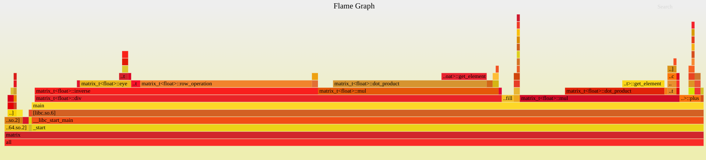
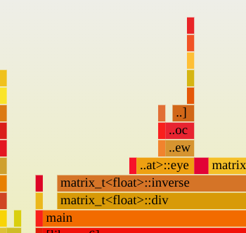
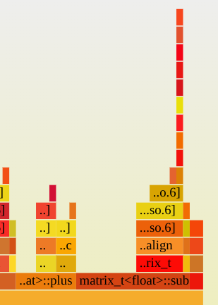
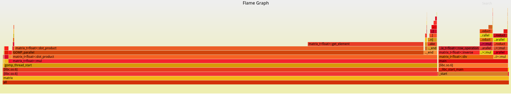
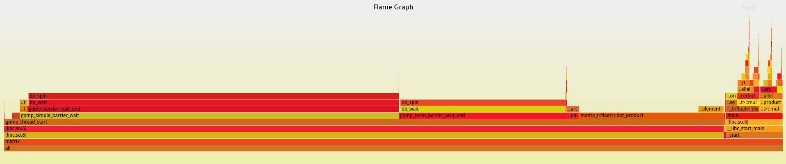
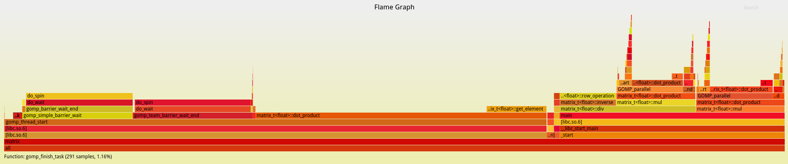

# 第二次学习任务

## 线程、进程、调度器

[线程进程调度器笔记]: ./线程&调度器.md

## 矩阵运算

```cpp
#include <cstring>
#include <iostream>

template <class T>
class matrix_t {
   private:
    // m row n column
    T* data;
    size_t m;
    size_t n;

    // return true if two matrix is cophenetic
    bool is_cophenetic(matrix_t* m) { return this->m == m->m && this->n == m->n; }

    // return the reference of the element in (m,n)
    T& get_element(size_t m, size_t n) { return data[this->n * m + n]; }

    // calculate the inner product of two vector (the w row of A and n column of B)
    //! the number of A's row must equal to B's column
    T dot_product(matrix_t* a, size_t m, matrix_t* b, size_t n) {
        T ret = 0;
        for (size_t i = 0; i < a->n; i++) {
            ret += a->get_element(m, i) * b->get_element(i, n);
        }
        return ret;
    }
	
    void row_operation(size_t row, float scale) {
        for (size_t i = row * this->n; i < row * this->n + n; i++) {
            this->data[i] *= scale;
        }
    }

    // add this row to another
    void row_operation(size_t row_from, size_t row_to, float scala) {
        size_t from = row_from * n;
        size_t to = row_to * n;
        for (size_t i = 0; i < n; i++) {
            data[to + i] += (data[from + i] * scala);
        }
    }

   public:
    matrix_t(size_t m, size_t n) {
        this->m = m;
        this->n = n;
        this->data = new T[m * n];
    }

    ~matrix_t() { delete[] data; }

    matrix_t* plus(matrix_t* matrix) {
        if (is_cophenetic(matrix) == false)
            return nullptr;
        size_t len = matrix->m * matrix->n;
        matrix_t* ret = new matrix_t(this->m, this->n);
        for (size_t i = 0; i < len; i++) {
            ret->data[i] = this->data[i] + matrix->data[i];
        }
        return ret;
    }

    matrix_t* sub(matrix_t* matrix) {
        if (is_cophenetic(matrix) == false)
            return nullptr;
        size_t len = matrix->m * matrix->n;
        matrix_t* ret = new matrix_t(this->m, this->n);
        for (size_t i = 0; i < len; i++) {
            ret->data[i] = this->data[i] - matrix->data[i];
        }
        return ret;
    }

    // multiple with a number
    matrix_t* mul(int n) {
        matrix_t* ret = new matrix_t(this->m, this->n);
        size_t len = this->m * this->n;
        for (size_t i = 0; i < len; i++) {
            ret->data[i] = this->data[i] * n;
        }
        return ret;
    }

    matrix_t* mul(matrix_t* matrix) {
        if (this->n != matrix->m)
            return nullptr;
        size_t len = this->m * matrix->n;
        matrix_t* ret = new matrix_t(this->m, matrix->n);
        for (size_t i = 0; i < len; i++) {
            size_t m = i / ret->n;
            size_t n = i % ret->n;
            ret->get_element(m, n) = dot_product(this, m, matrix, n);
        }
        return ret;
    }

    static matrix_t* eye(size_t n) {
        size_t len = n * n;
        matrix_t* ret = new matrix_t(n, n);
        for (size_t i = 0; i < n * n; i++) {
            ret->data[i] = (i / n == i % n) ? 1 : 0;
        }
        return ret;
    }

    // return the inverse matrix of self
    //! m must equal to n
    matrix_t* inverse() {
        matrix_t* ret = eye(n);
        T* tmp = this->data;
        this->data = new T[n * n];
        memcpy(this->data, tmp, n * n * sizeof(T));

        for (size_t i = 0; i < m; i++) {
            float s = 1.0 / get_element(i, i);
            row_operation(i, s);
            ret->row_operation(i, s);
            for (size_t j = i + 1; j < m; j++) {
                s = -get_element(j, i) / 1.0;
                row_operation(i, j, s);
                ret->row_operation(i, j, s);
            }
        }

        for (size_t i = 1; i < m; i++) {
            size_t j = i - 1;
            for (size_t j = i - 1; j + 1 != 0; j--) {
                float s = -get_element(j, i) / 1.0;
                row_operation(i, j, s);
                ret->row_operation(i, j, s);
            }
        }

        delete[] this->data;
        this->data = tmp;

        return ret;
    }

    matrix_t* div(matrix_t* m) {
        matrix_t* i = m->inverse();
        matrix_t* ret = this->mul(i);
        delete i;
        return ret;
    }

    void print() {
        size_t len = m * n;
        for (size_t i = 0; i < len; i++) {
            if (i % n == 0)
                std::cout << std::endl;
            std::cout.width(5);
            std::cout.precision(4);
            std::cout << data[i] << "  ";
        }
    }

    void fill(T* data) {
        for (size_t i = 0; i < this->m * this->n; i++) {
            this->data[i] = data[i];
        }
    }
};
```

## 性能分析与优化

### 后面加的改算法部分

```c
// 原始算法
for (int i = 0; i < N; i++)
	for (int j = 0; j < N; j++)
		for (int k = 0; k < N; k++)
			c_0[i][j] += a[i][k] * b[k][j];

// 先修改循环次序，行优先，cache friendly
for (int i = 0; i < N; i++)
	for (int k = 0; k < N; k++)
		for (int j = 0; j < N; j++)
			c[i][j] += a[i][k] * b[k][j];
//gcc multiply.c -o multiply -fopenmp -mavx2 -Og
//初始矩阵乘法运行耗时: 324.706162 ms
//优化后矩阵乘法运行耗时: 148.068361 ms
//加速比为：2.192948

// 加入SIMD
// 发现一个很好用的指令（vgatherqpd）,通过这个指令可以很容易读取有一定间隔的数据（比如二维数组或者结构体！）
__m256i vindex = _mm256_set_epi64x(0, N, 2 * N, 3 * N);
for (size_t i = 1; i < N; i++) {
	for (size_t k = 1; k < N; k += 4) {
        __m256d _a = _mm256_loadu_pd(a[i] + k);
		for (size_t j = 1; j < N; j++) {
			__m256d _b = _mm256_i64gather_pd(b[k] + j, vindex, 8);
			__m256d res = _mm256_mul_pd(_a, _b);
			c[i][j] += (res[0] + res[1] + res[2] + res[3]);
		}
	}
}
// gcc multiply.c -o multiply -fopenmp -mavx2 -Og
// 初始矩阵乘法运行耗时: 329.558565 ms
// 优化后矩阵乘法运行耗时: 122.880811 ms
// 加速比为：2.681937

// 加入openmp
// ...加入后加速比反而下降了...考虑是可能因为任务比较小，创建线程带来的开销较大，所以没有更快
```

### 性能分析

#### 热点分析与Perf工具的使用

​	热点分析可以快速找出调用最多的函数，对该函数进行优化可以带来更好的效果。perf是一个基于采样的kernel tracing工具，可以找出热点函数。

常用参数：

-   record 开始采样
    -   -e 采样的事件
    -   -g 采集栈
-   report 打开data文件进行分析
-   script 显示每个采样的详细信息

#### 火焰图

​	火焰图是根据采样得到的信息进行加工得到的更直观的数据。分析火焰图需要看调用栈最顶层且平滑的函数，对该函数进行优化有更好的效果。

### 优化矩阵算法

#### 分析

```cpp
//测试程序比较简单，单纯地循环 + - * / 
int main() {
    float nums_a[16] = { 1, 3, 5, 6, 4, 6, 3, 1, 7, 0, 9, 8, 4, 4, 3, 3,};
    float nums_b[16] = { 1, 1, 5, 6, 4, 3, 3, 1, 7, 4, 5, 7, 4, 2, 3, 7,};
    for (int i = 0; i < 100000; i++) {
        matrix_t<float>* ma = new matrix_t<float>(4, 4);
        matrix_t<float>* mb = new matrix_t<float>(4, 4);
        ma->fill(nums_a);
        mb->fill(nums_b);
        ma->plus(mb);
        ma->sub(mb);
        ma->mul(mb);
        mb->div(mb);
    }
    return 0;
}
```

运行后生成火焰图



可以看到以下几个函数是性能瓶颈

-   生成单位矩阵的eye函数
-   进行行矩阵变换的row_operation函数
-   对矩阵中单个元素进行访问的get_element函数
-   对两个向量进行内积的dot_product函数

因此接下来优化这几个函数

```cpp
static matrix_t* eye(size_t n) {
    size_t len = n * n;
    matrix_t* ret = new matrix_t(n, n);
    //对于初始化，可以将分支移出循环
    //for (size_t i = 0; i < n * n; i++) {
    //    ret->data[i] = (i / n == i % n) ? 1 : 0;
    //}
    // memset或许可以改成使用SIMD与多线程提高效率...
    memset(ret->data, 0, sizeof(T));
    for(size_t i = 0; i < n; i++)
        ret->data[i*n + i] = 1;
    return ret;
}
```

```cpp
void row_operation(size_t row, float scale) {
    // 可以利用SIMD与多线程提高并行度
    for (size_t i = row * this->n; i < row * this->n + n; i++) {
        this->data[i] *= scale;
    }
}

void row_operation(size_t row_from, size_t row_to, float scala) {
    size_t from = row_from * n;
    size_t to = row_to * n;
    // 同上
    for (size_t i = 0; i < n; i++) {
        data[to + i] += (data[from + i] * scala);
    }
}
```

```cpp
// return the reference of the element in (m,n)
T& get_element(size_t m, size_t n) { return data[this->n * m + n]; }

// calculate the inner product of two vector (the w row of A and n column of B)
//! the number of A's row must equal to B's column
T dot_product(matrix_t* a, size_t m, matrix_t* b, size_t n) {
    T ret = 0;
    // 循环之间没有依赖，可以并行处理
    for (size_t i = 0; i < a->n; i++) {
        ret += a->get_element(m, i) * b->get_element(i, n);
    }
    return ret;
}
```

（这样改过之后，可以看到eye函数ber一下变短了～）



#### 加入SIMD

##### add & sub

```cpp
#include <immintrin.h>

//为了SIMD更快，修改构造函数让内存对齐
matrix_t(size_t m, size_t n) {
    this->m = m;
    this->n = n;
    posix_memalign((void**)&this->data, 32, sizeof(T) * n * m);
}

//泛型的处理麻烦耶...假定都是32bit浮点...
matrix_t* plus(matrix_t* matrix) {
    if (is_cophenetic(matrix) == false)
        return nullptr;
    size_t len = matrix->m * matrix->n;
    matrix_t* ret = new matrix_t(this->m, this->n);
    size_t i = 0;
    __m256 a, b;
    for (i = 0; i + 4 < len; i += 4) {
        _mm256_load_ps(this->data + i);
        _mm256_load_ps(matrix->data + i);
        _mm256_store_ps(ret->data + i, _mm256_add_ps(a, b));
    }
    while (i < len) {
        ret->data[i] = this->data[i] + matrix->data[i];
        i++;
    }
    return ret;
}
```



对比可以看出，使用了SIMD后plus比同类型未使用SIMD的sub要好

##### row_operation

```cpp
void row_operation(size_t row, float scale) {
    __m256 scale_reg, tmp;
    size_t begin = row * this->n, i = 0;
#ifdef USE_SIMD
    scale_reg = _mm256_set_ps(scale, scale, scale, scale, scale, scale, scale, scale);
    for (i = 0; i + 8 < n; i += 8) {
        tmp = _mm256_loadu_ps(this->data + begin + i);
        _mm256_storeu_ps(this->data + begin + i, _mm256_mul_ps(tmp, scale_reg));
    }
#endif
    while (i < n) {
        this->data[begin + i] *= scale;
        i++;
    }
}

void row_operation(size_t row_from, size_t row_to, float scale) {
    size_t from = row_from * n;
    size_t to = row_to * n;
    size_t i = 0;
#ifdef USE_SIMD
    __m256 scale_reg, from_reg, to_reg;
    scale_reg = _mm256_set_ps(scale, scale, scale, scale, scale, scale, scale, scale);
    for (i = 0; i + 8 <= n; i += 8) {
        from_reg = _mm256_loadu_ps(this->data + from + i);
        to_reg = _mm256_loadu_ps(this->data + to + i);
        from_reg = _mm256_mul_ps(from_reg, scale_reg);
        to_reg = _mm256_add_ps(from_reg, to_reg);
        _mm256_storeu_ps(this->data + to + i, to_reg);
    }
#endif
    while (i < n) {
        data[to + i] += (data[from + i] * scale);
        i++;
    }
}
```

##### 修改后的matrix类

(改是改了，但是跑起来感觉并没有快很多...可能是因为矩阵不大的原因（最多才试过20*20）？)

```cpp
#include <immintrin.h>
#include <cstring>
#include <iostream>

#define USE_SIMD

template <class T>
class matrix_t {
   private:
    // m row n column
    T* data;
    size_t m;
    size_t n;

    // return true if two matrix is cophenetic
    bool is_cophenetic(matrix_t* m) { return this->m == m->m && this->n == m->n; }

    // return the reference of the element in (m,n)
    T& get_element(size_t m, size_t n) { return data[this->n * m + n]; }

    // calculate the inner product of two vector (the w row of A and n column of B)
    //! the number of A's row must equal to B's column
    static T dot_product(matrix_t* a, size_t m, matrix_t* b, size_t n) {
        T ret = 0;
        size_t i = 0;
        while (i < a->n) {
            ret += a->get_element(m, i) * b->get_element(i, n);
            i++;
        }
        return ret;
    }

    void row_operation(size_t row, float scale) {
        __m256 scale_reg, tmp;
        size_t begin = row * this->n, i = 0;
#ifdef USE_SIMD
        scale_reg = _mm256_set_ps(scale, scale, scale, scale, scale, scale, scale, scale);
        for (i = 0; i + 8 < n; i += 8) {
            tmp = _mm256_loadu_ps(this->data + begin + i);
            _mm256_storeu_ps(this->data + begin + i, _mm256_mul_ps(tmp, scale_reg));
        }
#endif
        while (i < n) {
            this->data[begin + i] *= scale;
            i++;
        }
    }

    void row_operation(size_t row_from, size_t row_to, float scale) {
        size_t from = row_from * n;
        size_t to = row_to * n;
        size_t i = 0;
#ifdef USE_SIMD
        __m256 scale_reg, from_reg, to_reg;
        scale_reg = _mm256_set_ps(scale, scale, scale, scale, scale, scale, scale, scale);
        for (i = 0; i + 8 <= n; i += 8) {
            from_reg = _mm256_loadu_ps(this->data + from + i);
            to_reg = _mm256_loadu_ps(this->data + to + i);
            from_reg = _mm256_mul_ps(from_reg, scale_reg);
            to_reg = _mm256_add_ps(from_reg, to_reg);
            _mm256_storeu_ps(this->data + to + i, to_reg);
        }
#endif
        while (i < n) {
            data[to + i] += (data[from + i] * scale);
            i++;
        }
    }

   public:
    matrix_t(size_t m, size_t n) {
        this->m = m;
        this->n = n;
        posix_memalign((void**)&this->data, 32, sizeof(float) * n * m);
    }

    ~matrix_t() {
        delete[] data;
    }

    matrix_t* plus(matrix_t* matrix) {
        if (is_cophenetic(matrix) == false)
            return nullptr;
        size_t len = matrix->m * matrix->n;
        matrix_t* ret = new matrix_t(this->m, this->n);
        size_t i = 0;
#ifdef USE_SIMD
        __m256 a, b;
        for (i = 0; i + 8 <= len; i += 8) {
            _mm256_load_ps(this->data + i);
            _mm256_load_ps(matrix->data + i);
            _mm256_store_ps(ret->data + i, _mm256_add_ps(a, b));
        }
#endif
        while (i < len) {
            ret->data[i] = this->data[i] + matrix->data[i];
            i++;
        }
        return ret;
    }

    matrix_t* sub(matrix_t* matrix) {
        if (is_cophenetic(matrix) == false)
            return nullptr;
        size_t len = matrix->m * matrix->n;
        matrix_t* ret = new matrix_t(this->m, this->n);
        size_t i = 0;
#ifdef USE_SIMD
        __m256 a, b;
        for (i = 0; i + 8 < len; i += 8) {
            _mm256_load_ps(this->data + i);
            _mm256_load_ps(matrix->data + i);
            _mm256_store_ps(ret->data + i, _mm256_sub_ps(a, b));
        }
#endif
        while (i < len) {
            ret->data[i] = this->data[i] - matrix->data[i];
            i++;
        }
        return ret;
    }

    matrix_t* mul(int n) {
        matrix_t* ret = new matrix_t(this->m, this->n);
        size_t len = this->m * this->n;
        for (size_t i = 0; i < len; i++) {
            ret->data[i] = this->data[i] * n;
        }
        return ret;
    }

    matrix_t* mul(matrix_t* matrix) {
        if (this->n != matrix->m)
            return nullptr;
        size_t len = this->m * matrix->n;
        matrix_t* ret = new matrix_t(this->m, matrix->n);
        for (size_t i = 0; i < len; i++) {
            size_t m = i / ret->n;
            size_t n = i % ret->n;
            ret->get_element(m, n) = dot_product(this, m, matrix, n);
        }
        return ret;
    }

    static matrix_t* eye(size_t n) {
        size_t len = n * n;
        matrix_t* ret = new matrix_t(n, n);
        memset(ret->data, 0, sizeof(T) * len);
        for (size_t i = 0; i < n; i++) {
            ret->data[i * n + i] = 1;
        }
        return ret;
    }

    // return the inverse matrix of self
    //! m must equal to n
    matrix_t* inverse() {
        matrix_t* ret = eye(n);
        T* tmp = this->data;
        posix_memalign((void**)&this->data, 32, sizeof(float) * n * m);
        memcpy(this->data, tmp, n * n * sizeof(T));

        for (size_t i = 0; i < m; i++) {
            float s = 1.0 / get_element(i, i);
            row_operation(i, s);
            ret->row_operation(i, s);
            for (size_t j = i + 1; j < m; j++) {
                s = -get_element(j, i) / 1.0;
                row_operation(i, j, s);
                ret->row_operation(i, j, s);
            }
        }

        for (size_t i = 1; i < m; i++) {
            size_t j = i - 1;
            for (size_t j = i - 1; j + 1 != 0; j--) {
                float s = -get_element(j, i) / 1.0;
                row_operation(i, j, s);
                ret->row_operation(i, j, s);
            }
        }

        delete[] this->data;
        this->data = tmp;

        return ret;
    }

    matrix_t* div(matrix_t* m) {
        matrix_t* i = m->inverse();
        matrix_t* ret = this->mul(i);
        delete i;
        return ret;
    }

    void print() {
        size_t len = m * n;
        for (size_t i = 0; i < len; i++) {
            if (i % n == 0)
                std::cout << std::endl;
            std::cout.width(5);
            std::cout.precision(4);
            std::cout << data[i] << "  ";
        }
    }

    void fill(T* data) {
        for (size_t i = 0; i < this->m * this->n; i++) {
            this->data[i] = data[i];
        }
    }
};
```

#### 加入多线程

##### dot_product

```cpp
//用多线程改写后变成这样...
//改完之后性能变得更差了（4*4矩阵的情况下）
static void* dot_product_routine(void* param) {
    struct params* p = (struct params*)param;
    T thread_ret = 0;
    for (size_t i = p->start; i < p->a->n; i += THREAD_NUM) {
        thread_ret += p->a->get_element(p->m, i) * p->b->get_element(i, p->n);
    }
    *(p->retval) = thread_ret;
    pthread_exit(NULL);
}

T dot_product(matrix_t* a, size_t m, matrix_t* b, size_t n) {
    T ret = 0;
    for (size_t i = 0; i < THREAD_NUM; i++) {
        param_list[i] = (params){a, b, m, n, i, 0, &retvals[i]};
        pthread_create(&threads[i], NULL, dot_product_routine, &param_list[i]);
    }
    T thread_ret = 0;
    for (size_t i = 0; i < THREAD_NUM; i++) {
        pthread_join(threads[i], NULL);
        ret += retvals[i];
    }
    return ret;
}
```

##### **什么时候合适用多线程优化？**

​	上面这个程序，改写后再次运行，发现执行效率远低于原来的版本。一方面是写的不好，于是改用openmp，发现效率仍然低于串行。

​	原因是线程的创建与销毁同样需要时间，**频繁被调用、执行时间短的部分并不合适**用多线程优化（上面的程序在测试时n=10，每次调用mul函数时该函数会被调用n^2^次）。

​	此外，**任务之间耦合度高，依赖性强的部分同样不合适**用多线程改写。

##### **线程越多越好吗？**

​	线程数同样会影响到优化的效果...看以下几个火焰图（数据规模改为1000*1000矩阵... 4\*4 的开多少个线程都更差orz）



​	这是不进行多线程优化的程序，可以看出，几个没优化好的函数的影响相较数据规模小时更加突出，尤其是dot_product函数占去了大部分的时间。（运行时间14s）



​	这是给dot_product固定开16个线程后的火焰图，运行时间稍微加快（11s），但是从火焰图可以看出，线程自旋等待同步浪费了不少时间。

​	

​	减少线程数后，程序性能反而得到了进一步提升。因此，优化时还需要根据数据的规模大小对线程数进行调整。

##### mul

​	根据上面的猜测，mul是一个更合适优化的函数（每次调用时计算n^2^次，并且每次计算之间并不存在关联）

```cpp
// pthread实在是太太太麻烦了，改用 std::thread了 （lambda表达式实在太香...）

matrix_t* mul(matrix_t* matrix) {
    if (this->n != matrix->m)
        return nullptr;
    size_t len = this->m * matrix->n;
    matrix_t* ret = new matrix_t(this->m, matrix->n);
    std::thread threads[THREAD_NUM];
    for (size_t i = 0; i < THREAD_NUM; i++) {
        threads[i] = std::thread([this, i, len, &ret, &matrix] {
            for (size_t j = i; j < len; j += THREAD_NUM) {
                size_t m = i / ret->n;
                size_t n = i % ret->n;
                ret->get_element(m, n) = dot_product(this, m, matrix, n);
            }
        });
    }
    for (size_t i = 0; i < THREAD_NUM; i++)
        threads[i].join();
    return ret;
}
```

##### 如何用多线程优化短小任务

​	短小而频繁的任务不合适用多线程优化的原因是线程创建和销毁带来的损失超过了多线程运行带来的好处。如果可以将这部分损失去掉，那么多线程优化短小任务还是有好处的。这里就要用到线程池技术，见另一个笔记 

[]: ./threadpool.md

（一个简单（很烂）的线程池实现，大致学习了一下线程池的原理...）

## 动态展示进程占用

```shell
top -b | grep pid -A 3
```

## HPL

### 什么是HPL测试

​	HPL测试，即让计算机用高斯消元解n阶方程组，由此来测试计算机的性能。衡量性能的标准是GFLOPS，即Giga Floating-point Operations Per Second，每秒进行的浮点运算次数（以G为单位）。

​	性能与硬件架构有关，但同样与软件的优化有关，并且不同的硬件配置要对应不同的软件优化才能得到好的性能。因此HPL测试有一个配置文件，允许对测试的一些内容如矩阵规模、各种看不懂的balabala参数等进行修改，来尝试找出硬件的最佳性能，就是HPL优化。

>   **理论峰值的计算**
>
>   ​	理论峰值即最理想情况下的性能，计算公式为 物理核心数*CPU频率\*浮点运算操作的CPI （IPC可以到这个文档找，好多架构都有https://www.agner.org/optimize/instruction_tables.pdf）

### HPL.dat

​	hpl.dat中各个字段的含义解释如下：

```
HPLinpack benchmark input file
Innovative Computing Laboratory, University of Tennessee
HPL.out      output file name (if any) 				输出文件名
file         device out (6=stdout,7=stderr,file)	输出到的位置
1            # of problems sizes (N)				分别计算的矩阵数
29 30 34 35  Ns										每个矩阵的规模
1            # of NBs								分别使用多大的分块计算矩阵
1 2 3 4      NBs									每次使用的分块大小
0            PMAP process mapping 					处理器阵列的排列方式（0为行优先，1为列～）
1            # of process grids (P x Q)				分别使用的处理器网格数
2 1 4        Ps										使用的P和Q（已经是看不懂的形状了）
2 4 1        Qs
16.0         threshold								测试的精度
1            # of panel fact						算法的方式（到21行）...
0 1 2        PFACTs (0=left, 1=Crout, 2=Right)		（好在有推荐配置。。。）
1            # of recursive stopping criterium		
2 4          NBMINs (>= 1)
1            # of panels in recursion
2            NDIVs
1            # of recursive panel fact.
0 1 2        RFACTs (0=left, 1=Crout, 2=Right)
1            # of broadcast							广播方式（这次在自己的机子上跑应该没差）
0            BCASTs (0=1rg,1=1rM,2=2rg,3=2rM,4=Lng,5=LnM)
1            # of lookahead depth					横向通信的深度...???
0            DEPTHs (>=0)
2            SWAP (0=bin-exch,1=long,2=mix)
64           swapping threshold
0            L1 in (0=transposed,1=no-transposed) form
0            U  in (0=transposed,1=no-transposed) form
1            Equilibration (0=no,1=yes)
8            memory alignment in double (> 0)		内存对齐

```

### 默认配置测试

```
HPLinpack benchmark input file
Innovative Computing Laboratory, University of Tennessee
HPL.out      output file name (if any)
file         device out (6=stdout,7=stderr,file)
1            # of problems sizes (N)
30		     			 Ns
1            # of NBs
4      				 NBs
0            PMAP process mapping (0=Row-,1=Column-major)
1            # of process grids (P x Q)
2        			 Ps
2        			 Qs
16.0         threshold
1            # of panel fact
2			         PFACTs (0=left, 1=Crout, 2=Right)
1            # of recursive stopping criterium
2            NBMINs (>= 1)
1            # of panels in recursion
2            NDIVs
1            # of recursive panel fact.
2			         RFACTs (0=left, 1=Crout, 2=Right)
1            # of broadcast
0            BCASTs (0=1rg,1=1rM,2=2rg,3=2rM,4=Lng,5=LnM)
1            # of lookahead depth
0            DEPTHs (>=0)
2            SWAP (0=bin-exch,1=long,2=mix)
64           swapping threshold
0            L1 in (0=transposed,1=no-transposed) form
0            U  in (0=transposed,1=no-transposed) form
1            Equilibration (0=no,1=yes)
8            memory alignment in double (> 0)

//稍微改了几个（似乎）对性能影响不大的参数...让报告看起来更简单
```


### 优化

-   矩阵大小大概占用内存的80%左右会得到比较好的效果
-   分块大小不能太大或太小，一般在256以下，NB*8得是cache line的倍数
-   P*Q = CPU数 = 进程数，P取小会更好

|   N   |  NB  |  P   |  Q   |   Gflops   |
| :---: | :--: | :--: | :--: | :--------: |
| 19200 | 128  |  2   |  4   | 2.2792e+02 |
| 38400 | 128  |  2   |  4   | 2.5635e+02 |
| 38400 | 128  |  1   |  8   | 2.5759e+02 |
| 38400 | 256  |  1   |  8   | 2.5258e+02 |

### 手册

（关于HPL.dat的配置，在文件夹里有TUNING文件，有对配置信息有更详细的描述）

## 拓展作业

[拓展作业笔记]: struct和dijkstra.md

